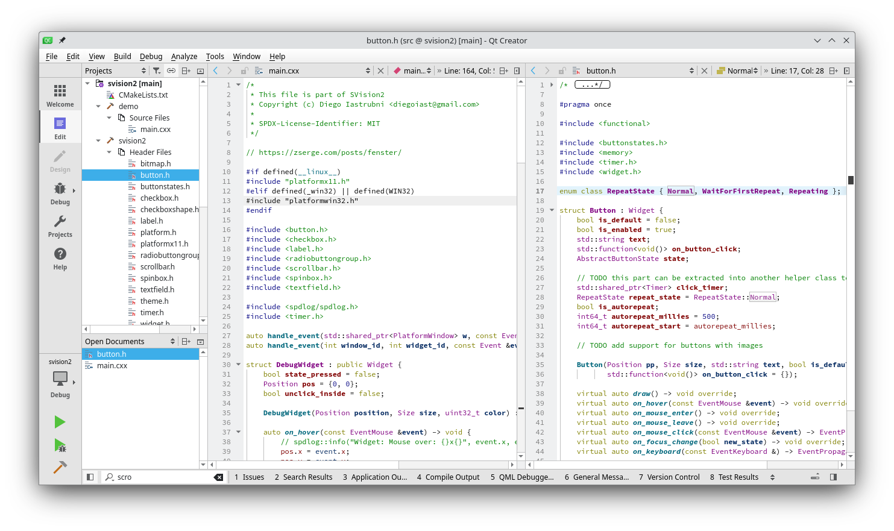
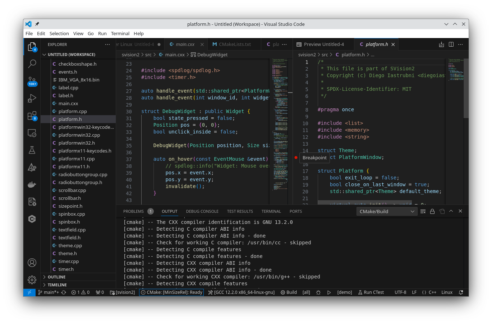

# Compiling under Linux

Install the packages for cmake, ninja, and basic X11 development
libraries - and python pip.

## Setup under Debian/Ubuntu

(if you already have conan package installer
(an older version) you might need to add `--force` to the end of the `pip3` command)

``` bash
apt install build-essential libx11-dev cmake ninja-build python3-pip clang-format
pip3 install conan==1.64.1
```

> *NOTE*
>
> Under Debian - you should use `pipx` to install applications. See this
> <https://itsfoss.com/install-pipx-ubuntu/> for more information

## Build from command line

To compile the demo app from the command line:

``` bash
cmake -s . -b build
cmake --build build --parallel
./build/bin/demo

# To reformat code after changes:
ninja -C build fix-clang-format
```

Any IDE with CMake support is good enough for you. I usually run QtCreator
and VSCode to run/debug.

## QtCreator

1. `File` -> `Open file or project` -> choose the directory in which you cloned SVision2.
2. Press `Control+r` to execute the program.
3. Press `Control+k` to quick search files in your project.
4. To use the same code style recommended by the project:
   1. `Edit` -> `Preferences` -> `C++` -> `ClangFormat options`
   2. Formatting mode: Full formatting
   3. Check all options



## VSCode

1. `File` -> `Open folder` -> choose the directory in which you cloned SVision2.
2. If you don't have this installed, install the *C/C++ Extension Pack*.
3. Press `Control+F5` to execute the program, if this does not work, at the
bottom of the window, choose `demo`, and press the play button:
4. To use the same code style recommended by the project:
   1. Open settings
   2. Search for `format on save`
   3. Mark the checkbox
   4. Mode should be *file*.


